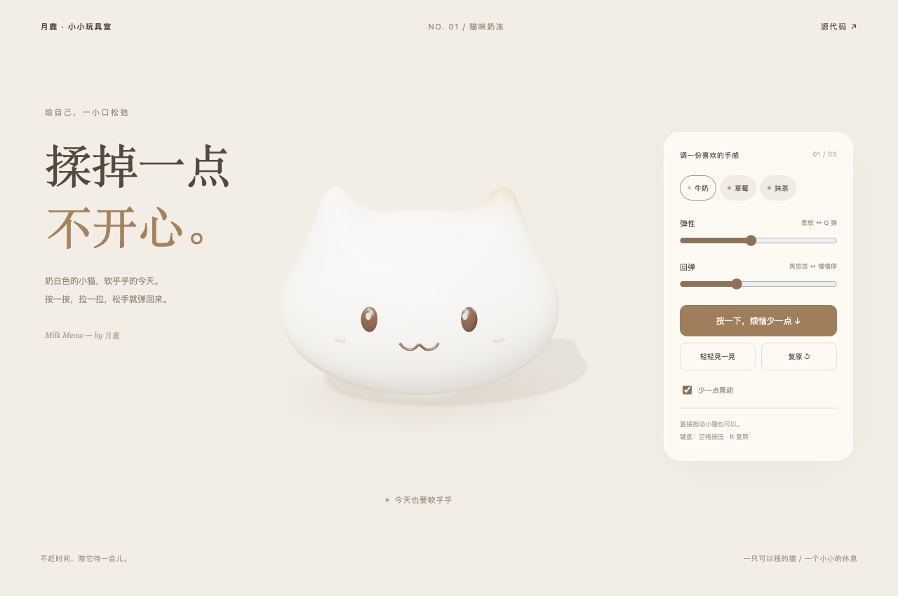

# 猫咪奶冻 · Milk Meow

一只可以按压、拖拽、松手回弹的奶白色小猫。给自己一点软乎乎的休息时间。



这是月鹿猫咪布丁设计的**独立重写版**，使用 Three.js / WebGL 2、参数化模型和阻尼弹簧形变。无需模型文件、API 密钥、后端或 WebGPU。

## 本地运行

Node.js 22.12+（也可使用较新 LTS 版本）。

```sh
npm install
npm run dev
```

打开终端显示的本地地址。请开启浏览器硬件加速。

```sh
npm test
npm run build
npm run preview
```

`dist/` 可部署到静态网站服务。默认部署于站点根路径；部署到 GitHub Pages 等子路径时使用 `npm run build -- --base=./`。

## 怎么玩

- 直接按住小猫，左右拖动，向下压或向上拉；松手回弹。
- 点击「按一下」或「轻轻晃一晃」。
- 切换牛奶、草莓、抹茶配色，调整弹性和回弹。
- 开启「少一点晃动」可减弱回摆；默认遵循系统减少动态效果设置。
- 聚焦画布后，空格按压、R 复原。按钮也支持键盘操作。

## 实现与边界

`src/motion.js` 实现三个有界阻尼弹簧，分别控制压缩及两个方向的剪切；`src/cat.js` 从球面参数生成圆脸和短耳朵，为身体、五官应用同一形变场；`src/main.js` 处理指针、渲染及页面控件。局部按压使用平滑衰减凹陷。

这是为解压手感设计的形变动画，不是体积有限元或 XPBD 软体仿真。不支持撕裂、自碰撞、任意旋转或挖取；不会复现旧版的每一种运动。手机需要支持 WebGL 2，具体设备性能会有差别。

## 来源说明

视觉灵感来自 Scott（[@scottstts](https://x.com/scottstts)）展示的果冻交互作品。月鹿早期实验曾参考 [Aimer779/pudding-lab](https://github.com/Aimer779/pudding-lab)，那个历史版本不包含在本仓库中。

本仓库重新实现了模型、形变算法、渲染、交互、界面和测试，没有复制该参考项目的源码、模型、纹理、测试或构建产物。猫咪外观方向保留月鹿此前确认的奶白圆脸、短耳朵与单侧焦糖斑设计。使用 AI 辅助编写。

本仓库源码采用 [MIT](LICENSE) 许可。Three.js 及其官方 RoomEnvironment 扩展采用 MIT 许可，安装依赖时包含各自许可；Vite 是构建工具。作者帖子的截图与视频不随仓库分发。
