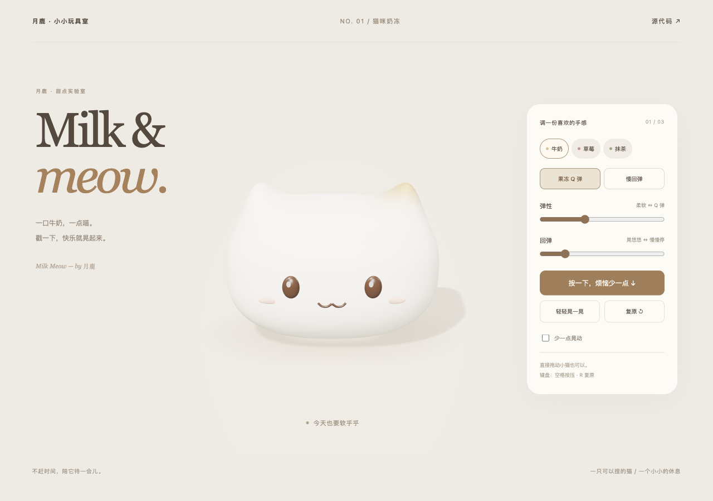

# 猫咪奶冻 · Milk Meow

一只可以按压、拖拽、松手回弹的奶白色小猫。给自己一点软乎乎的休息时间。

**[在线试玩](https://milk-meow-open.vercel.app/)**



这是月鹿猫咪布丁设计的**独立重写版**，使用 Three.js / WebGL 2、参数化模型和独立实现的 XPBD 体积软体。无需模型文件、API 密钥、后端或 WebGPU。

## 本地运行

Node.js 22.12+（也可使用较新 LTS 版本）。

```sh
npm install
npm run dev
```

打开终端显示的本地地址。请开启浏览器硬件加速。

```sh
npm test
npm run build
npm run preview
```

`dist/` 可部署到静态网站服务。默认部署于站点根路径；部署到 GitHub Pages 等子路径时使用 `npm run build -- --base=./`。

## 怎么玩

- 直接按住小猫，左右拖动，向下压或向上拉；松手回弹。
- 点击「按一下」或「轻轻晃一晃」。
- 切换牛奶、草莓、抹茶配色，调整弹性和回弹。
- 默认「果冻 Q 弹」模式，松手后会多次回摆；可切换「慢回弹」或开启「少一点晃动」。所有揉捏运动由主动操作触发。
- 聚焦画布后，空格按压、R 复原。按钮也支持键盘操作。

## 实现与边界

`src/soft-body.js` 实现 210 节点、720 四面体的 XPBD 求解器，包含边长弹性、体积保持、局部抓取、重力和地面摩擦。物理以 1/180 秒固定步长推进。内部阻尼衰减连接边上的相对运动，保留整体惯性；轻点施加局部冲量。`src/cat.js` 为身体和五官绑定同一网格；`src/main.js` 将鼠标命中映射回静止空间，通过相机平面拖拽抓取点。

物理使用包围猫咪的规则体积网格作为代理，并在离开舞台范围时整体限制位置；接触轮廓不等于精细猫咪表面。不支持撕裂、自碰撞或挖取，不承诺与参考作品逐帧一致。手机需要支持 WebGL 2，具体设备性能会有差别。

第一版全局弹簧实现保留在 `v1.0.0-spring` 标签中。`src/motion.js` 及其测试作为历史实现保留，当前页面不再使用该模块。

## 来源说明

视觉灵感来自 Scott（[@scottstts](https://x.com/scottstts)）展示的果冻交互作品。月鹿早期实验曾参考 [Aimer779/pudding-lab](https://github.com/Aimer779/pudding-lab)，那个历史版本不包含在本仓库中。

本仓库重新实现了模型、形变算法、渲染、交互、界面和测试，没有复制该参考项目的源码、模型、纹理、测试或构建产物。猫咪外观方向保留月鹿此前确认的奶白圆脸、短耳朵与单侧焦糖斑设计。使用 AI 辅助编写。

1.2 手感校准时阅读了参考项目的物理、时间步与抓取实现，分析内部阻尼和轻点冲量等思路；改动在本项目已有求解器中重新编写，未复制其源文件。感谢参考项目对软体交互的公开说明。

本仓库源码采用 [MIT](LICENSE) 许可。Three.js 及其官方 RoomEnvironment 扩展采用 MIT 许可，安装依赖时包含各自许可；Vite 是构建工具。作者帖子的截图与视频不随仓库分发。
